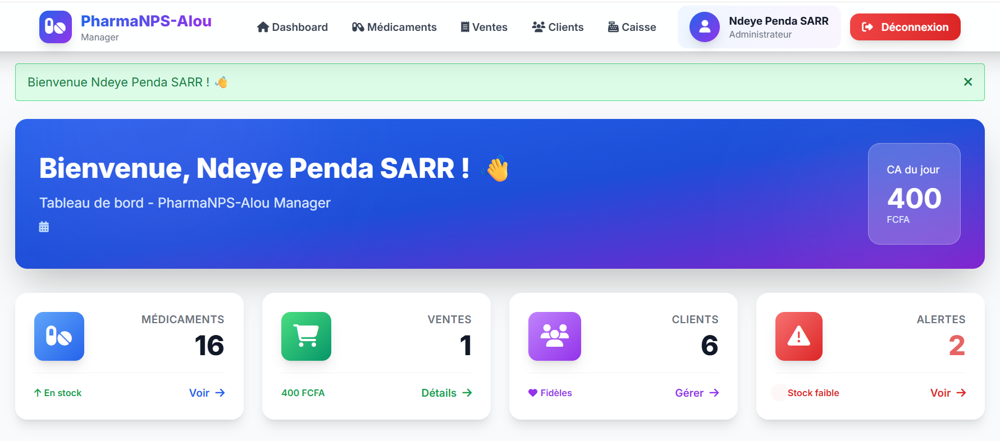
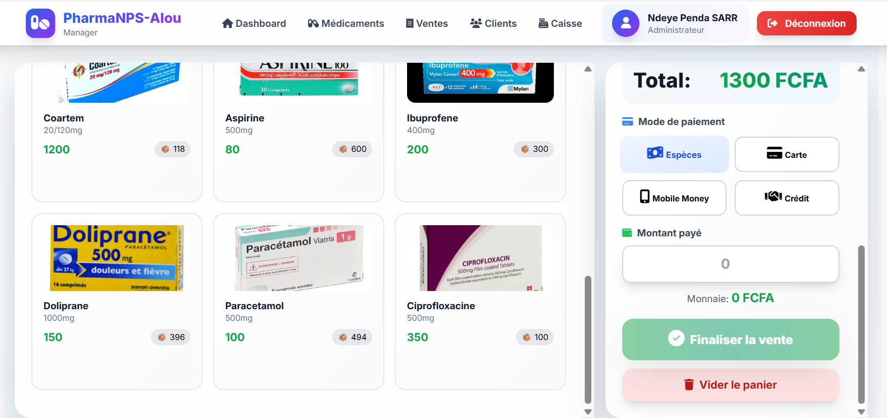
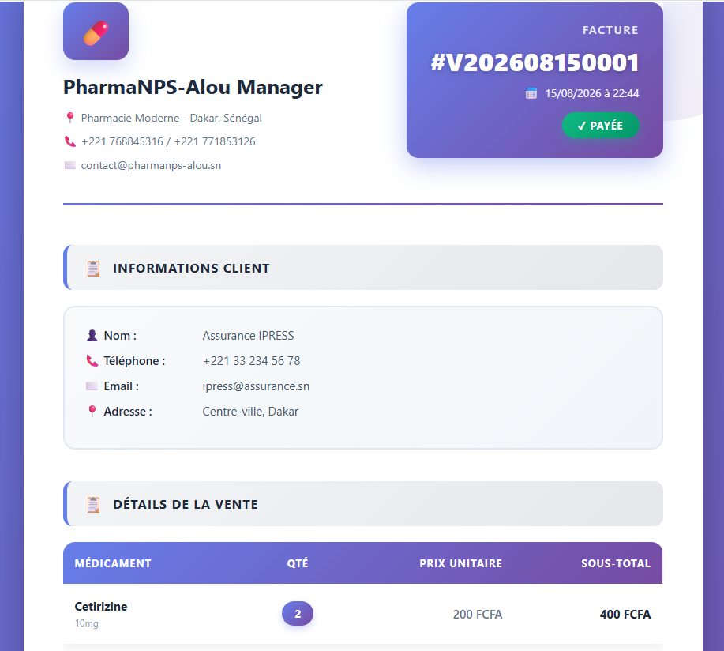
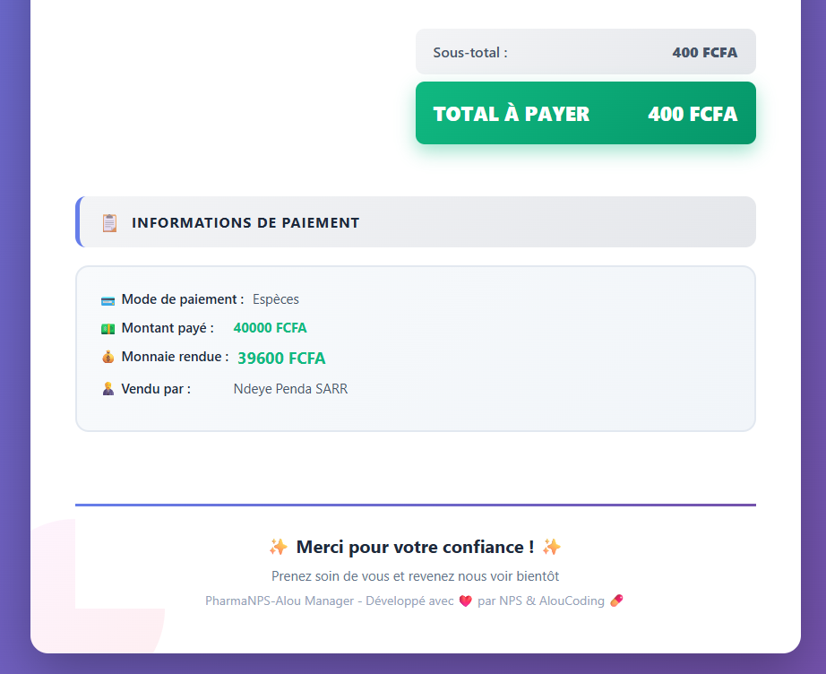
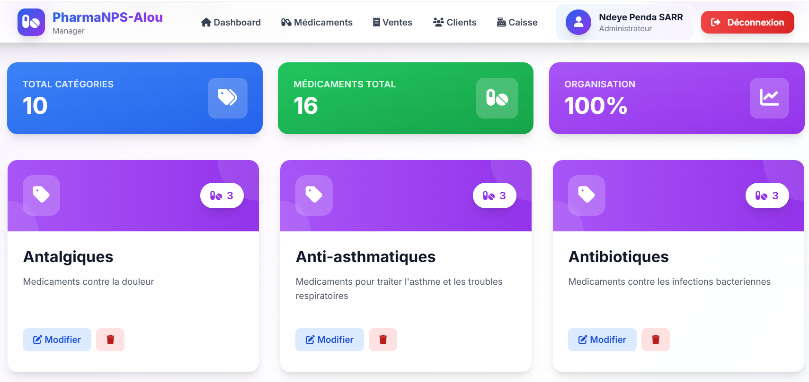
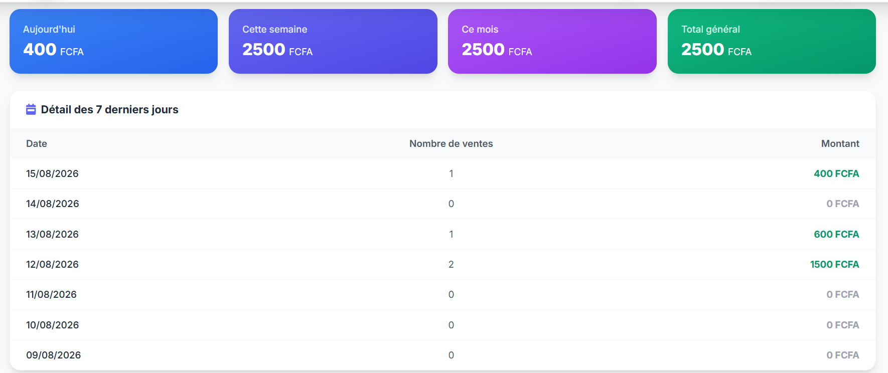
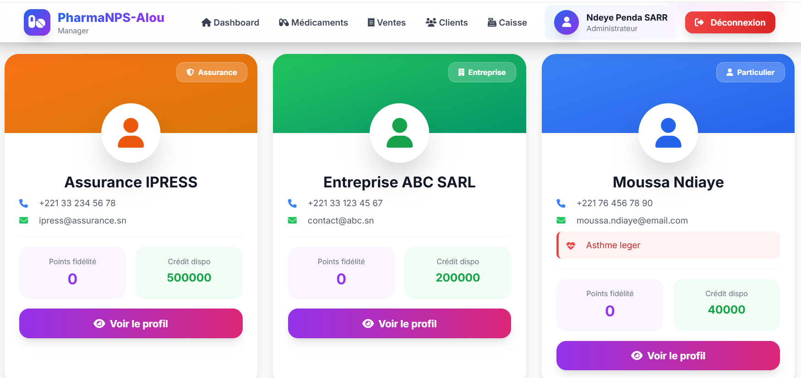
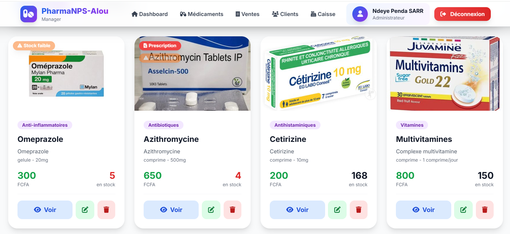

# 💊 PharmaNPS-Alou

Application web de gestion de pharmacie (stock, ventes, clients) développée avec **Django**.
Déployée sur Render : https://pharmanps-aloucoding-b8ex.onrender.com/

---

## Sommaire

- [Aperçu](#aperçu)
- [Fonctionnalités](#fonctionnalités)
- [Stack technique](#stack-technique)
- [Structure du projet](#structure-du-projet)
- [Modèles de données](#modèles-de-données)
- [Installation locale](#installation-locale)
- [Déploiement (Render)](#déploiement-render)
- [Qualité et tests](#qualité-et-tests)
- [Pistes d'amélioration](#pistes-damélioration)

---

## Aperçu

| | | |
|---|---|---|
|  Accueil |  Panier |  Facture |
|  Facture (variante) |  Catégories |  Chiffre d'affaire |
|  Clients |  Connexion |  Médicaments |

---

## Fonctionnalités

- **Authentification** : inscription, connexion, déconnexion, tableau de bord
- **Gestion des médicaments** : fiche produit (DCI, code-barres, forme galénique, dosage, prix, péremption), catégories, historique des mouvements de stock (entrée/sortie/perte/périmé/ajustement)
- **Point de vente (POS)** : recherche instantanée, panier, calcul automatique de la monnaie, génération de facture
- **Gestion clients** : particulier/entreprise/assurance, points de fidélité, système de crédit
- **Tableau de bord** : chiffre d'affaires (jour/semaine/mois/total), graphiques (Chart.js) des ventes des 7 derniers jours et du top 5 des produits vendus, alertes stock faible

## Stack technique

| Composant | Techno |
|---|---|
| Backend | Django 5.2.7 |
| Base de données | PostgreSQL (prod) / SQLite (dev) |
| Stockage médias | Cloudinary |
| Fichiers statiques | WhiteNoise |
| CSS | Tailwind CSS (compilé en CLI, pas de Node en prod) |
| Serveur d'application | Gunicorn |
| Hébergement | Render (web service + PostgreSQL) |

## Structure du projet

```
pharmanps-alou/
├── pharmanps_alou/      # Config Django (settings, urls, wsgi)
├── users/                # Authentification + dashboard
├── medications/          # Médicaments, catégories, stock
│   └── management/commands/seed_data.py   # Données de démo (idempotent)
├── sales/                # Point de vente, ventes, clients, ordonnances
├── templates/            # Templates HTML (base, medications, sales, users)
├── static/                # CSS (Tailwind), images locales des médicaments
├── build.sh               # Script de build Render (Tailwind, collectstatic, migrate, seed)
├── render.yaml             # Config du service Render
└── requirements.txt
```

## Modèles de données

**medications**
- `Category` — nom, description
- `Medication` — nom, DCI, code-barres (unique), catégorie, forme, dosage, prix d'achat/vente, stock, seuil d'alerte, péremption, image (Cloudinary + repli statique)
- `StockMovement` — trace chaque mouvement et **met à jour le stock automatiquement** à la sauvegarde

**sales**
- `Customer` — coordonnées, type, conditions médicales, fidélité, crédit
- `Sale` — numéro auto (`VYYYYMMDDxxxx`), remise, mode de paiement, statut, calcul auto du total et de la monnaie
- `SaleItem` — décrémente le stock du médicament et crée un `StockMovement` à la création
- `Prescription` — ordonnance liée à un client/une vente *(modèle présent mais non utilisé dans l'interface, voir plus bas)*

## Installation locale

```bash
git clone https://github.com/NdeyePendaSarr/pharmanps-aloucoding.git
cd pharmanps-aloucoding
python -m venv venv && source venv/bin/activate
pip install -r requirements.txt

# .env à la racine :
# SECRET_KEY=change-me
# DEBUG=True

python manage.py migrate
python manage.py seed_data      # données de démo
python manage.py createsuperuser
python manage.py runserver
```

## Déploiement (Render)

`build.sh` s'exécute à chaque déploiement : installe les dépendances, compile Tailwind, `collectstatic`, `migrate`, puis `init_admin` (crée le superuser depuis les variables d'environnement `ADMIN_USERNAME` / `ADMIN_EMAIL` / `ADMIN_PASSWORD`, idempotent) et `seed_data` (idempotent également, ne remplit que si la base est vide).

Variables d'environnement à définir sur Render : `SECRET_KEY` (auto-générée par `render.yaml`), `DEBUG=False`, `DATABASE_URL` (liée à la base Postgres), `CLOUDINARY_CLOUD_NAME`, `CLOUDINARY_API_KEY`, `CLOUDINARY_API_SECRET`, `ADMIN_USERNAME`, `ADMIN_EMAIL`, `ADMIN_PASSWORD`.

---

## Qualité et tests

Le code a été relu de bout en bout (modèles, vues, templates, settings) et plusieurs scénarios ont été testés directement en shell Django (suppression d'un médicament déjà vendu, vente dépassant le stock disponible, vente normale, panier avec plusieurs lignes du même produit). Les problèmes rencontrés ont été corrigés et re-testés — tout fonctionne comme attendu.

---

## Pistes d'amélioration

- Finir l'intégration de `Prescription` (créer les vues/URLs/templates, pour l'instant accessible seulement depuis l'admin)
- Ajouter une pagination (`django.core.paginator.Paginator`) sur les listes de médicaments, ventes et clients
- Filtrer le stock (faible/périmé/bientôt périmé) directement via l'ORM plutôt qu'en Python
- Regrouper ou nettoyer les scripts de maintenance à la racine (`populate_db.py`, `check_duplicates.py`, `compare_stats.py`, `fix_encoding.py`)
- Ajouter des tests automatisés sur la logique de stock/vente


---

Conçu et développé par **Ndeye Penda Sarr** - 2025.